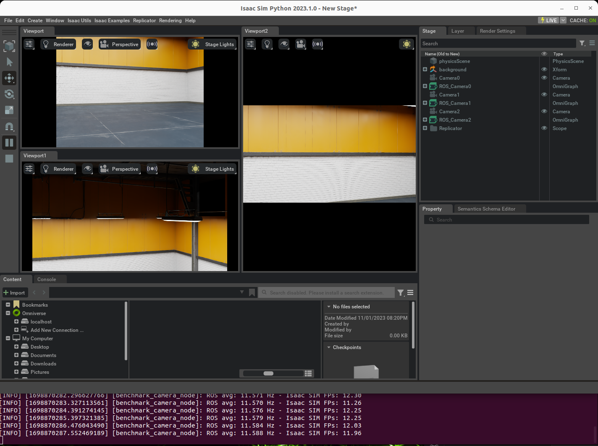

# isaac_camera_benchmark

This tool run a simple test to check the performance of your desktop on Isaac SIM.



You can run multiple test and read:

* Camera performance from 1 to more
* Change resolution
* ROS2

This tool will plot on your bash the ROS topic frequency average and the FPS from Isaac SIM.

This tool will run a set of camera on your Isaac SIM environment and will start to rotate every camera autonomously.

## Hardware required

Workstation:

1. x86/64 machine
2. Install Ubuntu 20.04
3. NVIDIA Graphic card with RTX
4. Display
5. Keyboard and Mouse

### Run demo

Clone this repository and move to repository folder

```console
git clone https://github.com/nvidia_iot/isaac_camera_benchmark.git
cd isaac_camera_benchmark
```

Run the installer

```console
./run_camera_benchmark.sh
```

#### NVIDIA Isaac SIM

Follow the documentation on NVIDIA Isaac SIM [Workstation install](https://docs.omniverse.nvidia.com/app_isaacsim/app_isaacsim/install_workstation.html)

1. Download the [Omniverse Launcher](https://www.nvidia.com/en-us/omniverse/)
2. [Install Omniverse Launcher](https://docs.omniverse.nvidia.com/prod_launcher/prod_launcher/installing_launcher.html)
3. Install [Cache](https://docs.omniverse.nvidia.com/prod_nucleus/prod_utilities/cache/installation/workstation.html) from the Omniverse Launcher
4. Install [Nucleus](https://docs.omniverse.nvidia.com/prod_nucleus/prod_nucleus/workstation/installation.html) from the Omniverse Launcher

Open Omniverse Launcher


Move to Library and choice "Omniverse Isaac SIM" and download the latest 2022.2 version


## Setup Isaac Camera Benchmark

To add a new camera or change the benchmark simulation, you can simply create a new file `config.json` that override the default configuration.

### Add a new camera

Make a new field called `camera` and for each camera add these fields:

* `translate` position camera inside the environment
* `resolution` Camera resolution, suggested
  * 640 x 480
  * 1024 x 768
  * **FHD** - 1920 x 1080
  * **2K** - 2560 x 1440
  * **4K** - 3840 x 2160

Example a json file can be composed in this way

```json
{
    'camera': [
        {'translate': [-1, 5, 1], 'resolution': [640, 480]},
        {'translate': [0, 0, 0], 'resolution': [1024, 768]},
    ]
}
```

### Change simulation type

On the `simulation` field you can change the simulation configuration, example make it headless like the example below

```json
{
    'simulation': {"renderer": "RayTracedLighting", "headless": True}
}
```

## Record camera

If you want to record in a ros2 bag file all camera you can simply run

```console
./ros2record.sh
```

That simply export all camera in a **rosbag2** folder, the output will be like the picture below.


All ros2bag file will be available on folder `isaac_camera_benchmark/rosbag`.
